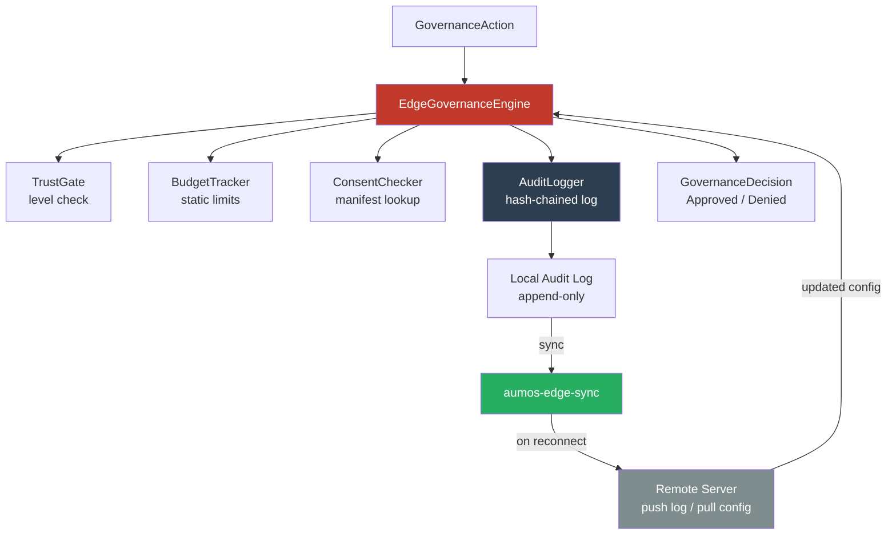

# aumos-edge-runtime

[](https://github.com/aumos-ai/aumos-edge-runtime)
[](LICENSE)
[](https://www.rust-lang.org/)

On-device governance enforcement for AI agents operating offline or on constrained hardware.

Part of the [AumOS](https://github.com/aumos-ai) open-source governance stack.

---

## Why Does This Exist?

### The Problem: Governance Assumes a Cloud Connection

Most AI governance systems are cloud-first. They call a central server to check whether an agent is allowed to perform an action, log the decision to a hosted audit trail, and pull updated policies from a remote config store. This works fine in a data center.

It fails entirely in the real world.

Consider an AI agent running on a robot in a remote warehouse, a medical device in a rural clinic, a sensor in an oil field, or an autonomous vehicle in a tunnel. These systems operate with intermittent or zero connectivity. If governance requires a network round-trip to approve every action, the agent either stops working when offline or bypasses governance entirely — and the second outcome is far more common.

The failure mode is not a slow response. The failure mode is "we turned off governance because the network was down, and the agent did something it should not have."

### The Solution: Governance That Works Anywhere

`aumos-edge-runtime` is a Rust-based governance engine that runs the full governance decision loop entirely on-device. No network round-trip is required to evaluate whether an agent's action is permitted.

Think of it like having a security guard permanently stationed on the remote oil rig, rather than calling headquarters every time someone wants to open a valve. The guard has a rulebook. They enforce it. When the supply boat arrives, they hand over their logbook and receive updated instructions.

The engine enforces:
- **Trust level gating** — actions are permitted or denied based on the agent's configured trust level
- **Budget tracking** — cumulative cost of agent actions is tracked against a static budget
- **Consent checks** — data access actions are evaluated against a consent manifest
- **Append-only audit** — every decision is SHA-256 hash-chained; records cannot be silently modified

When connectivity returns, the sync engine pushes the local audit log to a remote server and pulls updated configuration — but enforcement never waits for this.

### What Happens Without This

Without offline-capable governance:
- Agents in air-gapped or low-connectivity environments operate without any governance checks
- A network outage silently disables all governance for affected devices
- Audit logs have gaps corresponding to offline periods
- There is no way to enforce policy on edge hardware without adding connectivity requirements to every device

---

## Design Principles

- **Configuration-driven** — all rules come from a static `EdgeConfig` file; no adaptive behavior
- **Append-only audit** — every decision is SHA-256 hash-chained; records cannot be silently modified
- **Offline-first** — enforcement never blocks on network; sync is best-effort
- **Minimal footprint** — the core crate targets constrained hardware; no hidden `std` dependencies
- **Binding-ready** — PyO3 and NAPI-RS stubs let Python and TypeScript consumers call the same engine

---

## Crates

| Crate | Description |
|---|---|
| [`aumos-edge-core`](crates/aumos-edge-core/) | Core governance engine: trust, budget, consent, audit log |
| [`aumos-edge-sync`](crates/aumos-edge-sync/) | Sync engine: push local state, pull remote config |
| [`aumos-edge-python`](crates/aumos-edge-python/) | PyO3 Python binding stubs |
| [`aumos-edge-node`](crates/aumos-edge-node/) | NAPI-RS TypeScript/Node.js binding stubs |

---

## Quick Start

### Prerequisites

- Rust stable (1.75+)
- `cargo` in your PATH
- An `edge-config.toml` file (see [`docs/deployment.md`](docs/deployment.md) for format)

### Install

```bash
# Add to your Cargo.toml
[dependencies]
aumos-edge-core = "0.1"
```

Or clone and build from source:

```bash
git clone https://github.com/aumos-ai/aumos-edge-runtime
cd aumos-edge-runtime
cargo build --workspace
```

### Minimal Working Example

```rust
use aumos_edge_core::{EdgeGovernanceEngine, GovernanceAction, ActionKind};
use std::path::Path;

fn main() -> Result<(), Box<dyn std::error::Error>> {
    // Load the engine from a static config file — no network needed
    let mut engine = EdgeGovernanceEngine::from_config(Path::new("edge-config.toml"))?;

    // Describe the action the agent wants to take
    let action = GovernanceAction {
        agent_id: "agent-001".to_string(),
        kind: ActionKind::DataRead,
        resource: "user-profile".to_string(),
        estimated_cost: 0.01,
        metadata: Default::default(),
    };

    // Evaluate — always returns immediately, no network call
    let decision = engine.evaluate(&action);
    println!("Decision: {:?}", decision.outcome);
    // Decision: Approved

    Ok(())
}
```

**What just happened?**

1. The engine loaded its rulebook from `edge-config.toml` — trust levels, budget limits, consent manifest.
2. It evaluated the action against the rules: Does `agent-001` have sufficient trust to read `user-profile`? Does the cumulative cost stay within budget? Is there consent for this data access?
3. It returned `Approved` (or `Denied` with a reason) — entirely in-process, no network.
4. The decision was appended to the local SHA-256 hash-chained audit log.

When the device reconnects, `aumos-edge-sync` uploads the audit log and downloads updated config.

---

## Architecture Overview



The engine is the single decision point. All four checks (trust, budget, consent, audit) run synchronously in the same process. The sync engine is a separate crate that runs independently when connectivity is available — it never blocks the governance hot path.

In the AumOS ecosystem, the edge runtime sits at the furthest point from the cloud. Agents on devices use it as their local enforcement layer. Their decisions eventually sync up to the central audit infrastructure, providing end-to-end governance continuity across online and offline periods.

---

## Offline Mode

The engine operates in two modes:

| Mode | Network | Behavior |
|------|---------|----------|
| Online | Connected | Enforce locally, sync audit log, pull updated config |
| Offline | Disconnected | Enforce locally using last-known config, buffer audit events |

Enforcement is identical in both modes. The only difference is whether the audit log and config are synced. See [`docs/offline-mode.md`](docs/offline-mode.md).

---

## Sync Protocol

When connectivity returns, `aumos-edge-sync` performs a two-phase sync:

1. **Push** — upload the buffered audit log to the remote server
2. **Pull** — download the latest `EdgeConfig` and apply it to the engine

Sync is best-effort and idempotent. See [`docs/sync-protocol.md`](docs/sync-protocol.md).

---

## Who Is This For?

**Developers** building AI agents for embedded systems, IoT, robotics, or any environment where network reliability cannot be assumed.

**Enterprise teams** deploying AI at the edge — retail stores, manufacturing floors, medical devices, vehicles — who need governance continuity across online and offline periods, with a complete audit trail that syncs when connectivity returns.

---

## Related Projects

| Repo | How it relates |
|------|---------------|
| [agent-did-framework](https://github.com/aumos-ai/agent-did-framework) | Provides the agent identity that edge runtime validates |
| [mcp-server-trust-gate](https://github.com/aumos-ai/mcp-server-trust-gate) | Cloud-side governance counterpart for online environments |
| [trust-certification-toolkit](https://github.com/aumos-ai/trust-certification-toolkit) | Test your edge runtime implementation for AumOS certification |
| [aumos-core](https://github.com/aumos-ai/aumos-core) | Core governance protocol definitions shared across all runtimes |

---

## Deployment

See [`docs/deployment.md`](docs/deployment.md) for configuration reference and platform-specific build instructions (Linux ARM, WASM target, etc.).

---

## Fire Line

Hard architectural constraints are documented in [`FIRE_LINE.md`](FIRE_LINE.md).

---

## License

Business Source License 1.1 — see [`LICENSE`](LICENSE).

Copyright (c) 2026 MuVeraAI Corporation
